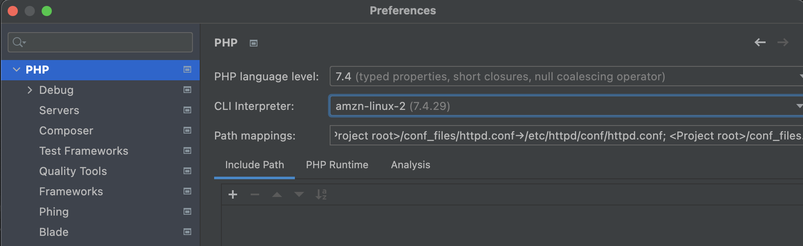

# httpd-php-fpm-docker-amzn-linux-template

## middlewares

- apache
- php
- php-fpm

## start

```
docker-compose up -d
```

## Stop & delete

```
docker-compose down
```

## Go into amazon linux container

```
docker exec -it amzn-linux-2 /bin/sh
```

## Debug settings




